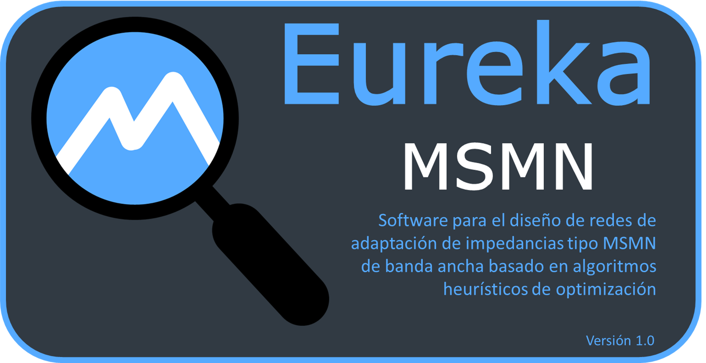
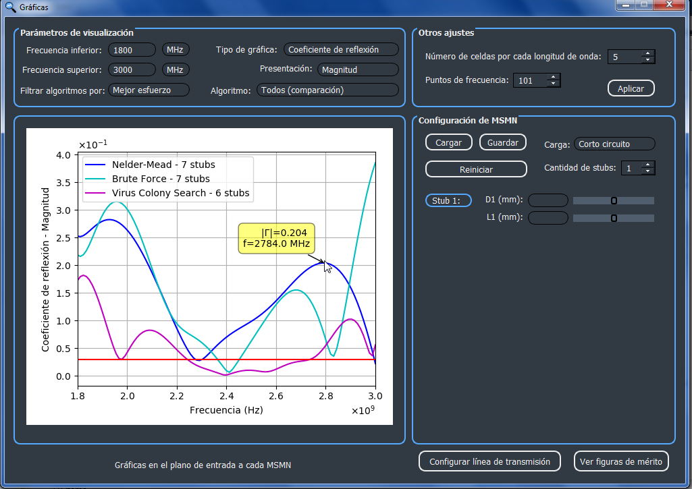
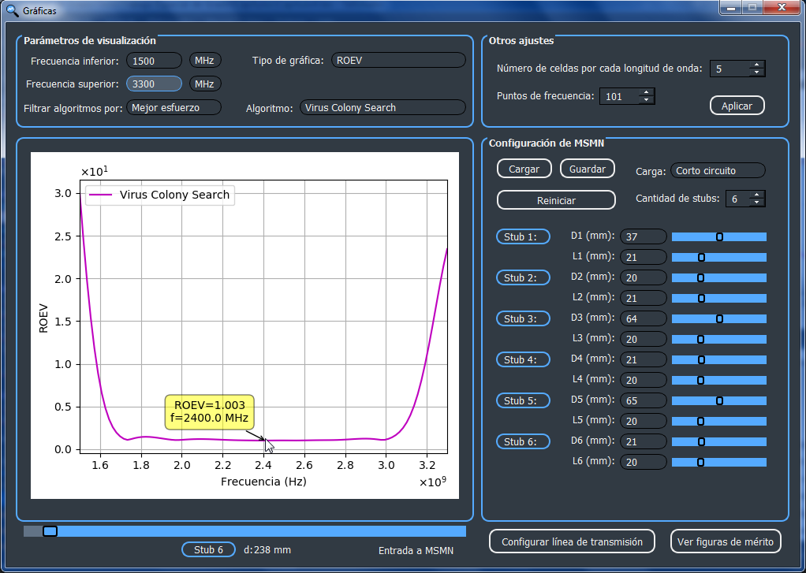

## Description
This is a tool to automatic design Multiple-Stub Matching Networks (MSMN) for wideband on Transmission Lines, using Metaheuristics Optimization Algorithms.

## Author
**Abraham Hidalgo**
* [LinkedIn](https://www.linkedin.com/in/hidalgoabraham/)

## Screenshots

App's logo:

 
 
 
 
Main window: Configure the transmission line system and select the heuristic algorithms

 
 
 
 
Graphics: Reflection coefficient vs. frequency

 
 
 
 
Results: ROEV (Voltage Standing Wave Ratio) vs. frequency - A wideband impedance matching network

## How to install:
For Windows OS, you can run the Eureka MSMN.exe file of the package folder available on: https://drive.google.com/file/d/1QnXycnOk792U68OeCCPjIsB6TgkOxBgr/view?usp=sharing.

Also, you can download this repository an run the Eureka.py file.
