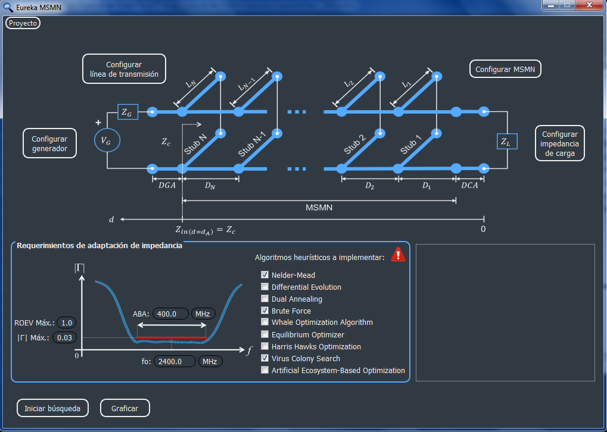

## Description
This is a tool to automatic design Multiple-Stub Matching Networks (MSMN) for wideband on Transmission Lines, using Metaheuristics Optimization Algorithms.

## Author
**Abraham Hidalgo**
* [LinkedIn](https://www.linkedin.com/in/hidalgoabraham/)

## Screenshots
App's logo:

Main window: Configure the transmission line system and select the heuristic algorithms

Graphics:

Results: ROEV (Voltage Standing Wave Ratio) vs. frequency - A wideband impedance matching network

